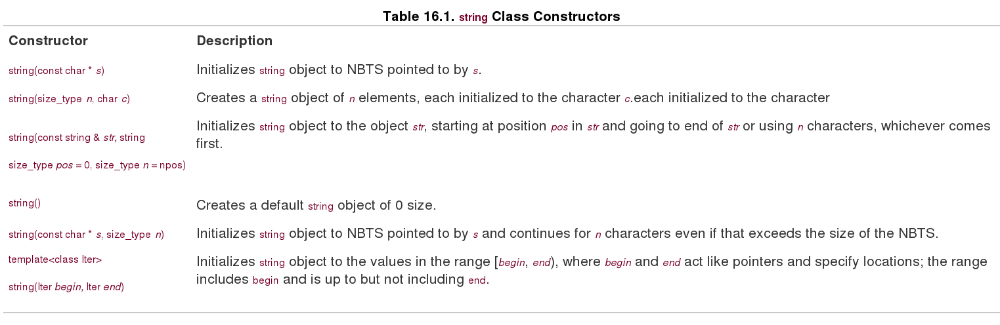
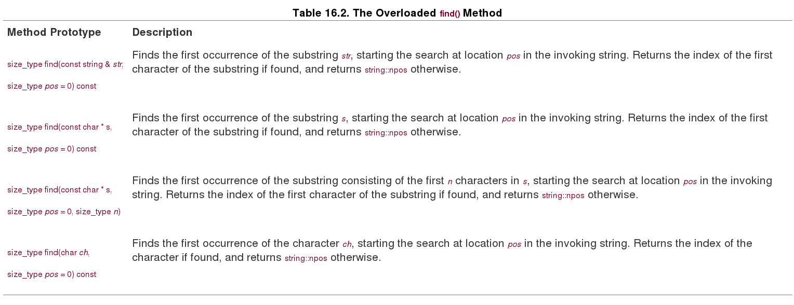
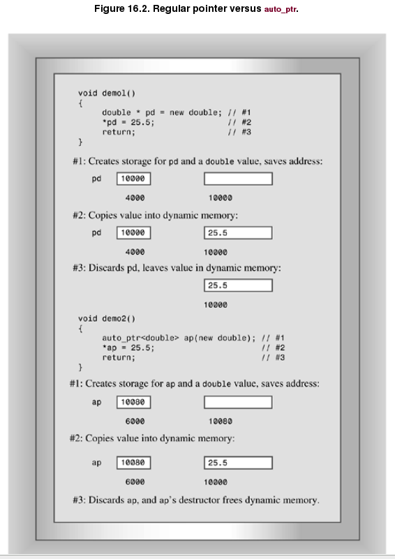

## String Class ##

### Constructing a String ###

### string class input ###

For C-style strings, recall, you have three options:

        char info[100];
        
        cin >> info;             // read a word
        
        cin.getline(info, 100);  // read a line, discard \n
        
        cin.get(info, 100);      // read a line, leave \n in queue
 
As long as the input sequence is shorter than the maximum allowable number of characters for a string object, the operator>>(istream &, string &) function **automatically dimensions the string object** to fit the input string. The upshot is that you can use >> with string objects just as you do with C-style strings, but without worrying about overrunning the array size:   
    
        char fname[10];
        
        cin >> fname;      // could be a problem if input size > 9 characters
        
        string lname;
        
        cin >> lname;      // can read a very, very long word

To get the same syntax to work with a **string** object would require adding a new member function to the **istream** class, which would not be wise. Instead, the string library defines a non-member function **getline()** that takes an istream object as its first argument and a **string** object as its second argument. Thus, it's used as follows to read a line of input into a **string** object:

        cin.getline(fname, 10);
        
        string fullName;
        getline(cin, fullName);  
        //instead of cin.getline(fname, 10); and utomatically dimensions the string object
        

### Compare Strings ###

You can compare strings. All six relational operators are overloaded for **string** objects, Each relational operator is overloaded three ways so that you can compare a string object with another string object, compare a string object with a C-style string, and compare a C-style string with a string object:

        string snake1("cobra");
        
        string snake2("coral");
        
        char snake3[20] = "anaconda";
        
        if (snake1 < snake 2)           // operator<(const string &, const string &)
        
            ...
        
        if (snake1 == snake3)           // operator==(const string &, const char *)
        
            ...
        
        if (snake3 != snake2)           // operator!=(const char *, const string &)

You can determine the size of a string. Both the **size()** and **length()** member functions return the number of characters in a string:        

        if (snake1.length() == snake2.size())
            cout << "Both strings have the same length.\n"
            
Why two functions that do the same thing? The **length()** member comes from earlier versions of the string class, while **size()** was added for STL compatibility.

### String Search ###

You can search a string for a given substring or character in a variety of ways. Table 16.2 provides a short description of four variations of a **find()** method. Recall that **string::npos** is the maximum possible number of characters in a string, typically the largest **unsigned int** or **unsigned long** value.

The library also provides the related methods **rfind(), find_first_of(), find_last_of(), find_first_not_of(), and find_last_not_of()**, each with the same set of overloaded function signatures as the find() method. The **rfind()** finds the last occurrence of a substring or character. The **find_first_of()** finds the first occurrence in the invoking string of any of the characters in the argument. For example, the statement:

        int where = snake1.find_first_of("hark");
        
would return the location of the **r** in **"cobra"** (i.e., the index 3) because that's the first occurrence of any of the letters in **"hark"** in **"cobra"**. The **find_last_of()** method works the same, except it finds the last occurrence. Thus, the statement:

        int where = snake1.last_first_of("hark");
        
would return the location of the **a** in **"cobra"**. The **find_first_not_of()** method finds the first character in the invoking string that is not a character in the argument. So

        int where = snake1.find_first_not_of("hark");
        
would return the location of the **c** in **"cobra"**, for c is not found in hark. We leave the description of **find_last_not_of()** as an exercise for the reader.

### String Compare ###

You can use the overloaded **==** operator to compare string objects. However, the case-sensitive nature in which the **==** operator performs its equality comparison can be a problem in some cases. Often, two strings need to be compared for equality without respect to their case. For example, a program may compare input from a user with a constant value, and the user may not use the same case. Consider the following sample:

        #include <string>       //  string object
        
        
        
        ...
        
        string strA;
        
        cin >> strA;  // assume user enters Maplesyrup
        
        string strB = "mapleSyrup";  // stored constand
        
        
        
        if( strA == strB )
        
        {
        
          cout << "The strings are equal.\n";
        
        }
        
        else
        
        {
        
          cout << "The strings are not equal.\n";
        
        }
        
Because 'M' is different from 'm' and 's' is different from 'S', the output is this:
    
        The strings are not equal.
        
What if your program needed to perform a case-insensitive comparison on strA and strB? Many C libraries provide a **stricmp()** or **_stricmp()** function that does a case-insensitive test. (However, this function isn't listed in the C standard, so it's not universally available.) By creating your own overloaded version of this function, you can cobble together a simple workaround

        #include <string.h>  // for stricmp() on many systems
        
        #include <string>    // string object
        
        
        
        string strA;
        
        cin >> strA;  // assume user enters Maplesyrup
        
        string strB = "mapleSyrup";  // stored constant
        
        inline bool stricmp( const std::string& strA,
        
                             const std::string& strB )  // overloaded function
        
        {
        
          return stricmp( strA.c_str(), strB.c_str() ) == 0;    // C function
        
        }
        
        
        
        bool bStringsAreEqual = stricmp( strA, strB );
       
### What Else ###

The string library supplies many other facilities. There are functions for erasing part or all of a string, for replacing part or all of one string with part or all of another string, for inserting material into a string or removing material from a string, for comparing part or all of one string with part or all of another string, and for extracting a substring from a string. There's a function for copying part of one string to another string, and a function for swapping the contents of two strings. Most of these functions are overloaded so that they can work with C-style **strings** as well as with string objects. **Appendix F** describes the string library function briefly.

This section has treated the string class as if it were based on the char type. In fact, as mentioned earlier, the string library really is based on a template class:

        template<class charT, class traits = char_traits<charT>,
        
                class Allocator = allocator<charT> >
        
        basic_string {...};
        
The class includes the following two **typedefs**:

        typedef basic_string<char> string;
        
        typedef basic_string<wchar_t> wstring;
        
This allows you to use strings based on the **wchar_t** as well as the char type. You even could develop some sort of character-like class and use the **basic_string** class template with it, providing your class met certain requirements. The **traits** class is a class that describes specific facts about the chosen character type, such as how to compare values. There are predefined specializations of the **char_traits** template for the **char** and wchar_t types, and these are the default values for traits. The **Allocator** class represents a class to manage memory allocation. There are predefined specializations of the **allocator** template for the **char** and **wchar_t** types, and these are the defaults. They use **new** and **delete** in the usual fashion, but you could reserve a chunk of memory and provide your own allocation methods.

## The auto_ptr Class ##

The **auto_ptr** class is a **template class** for managing the use of dynamic memory allocation. Let's take a look at what might be needed and how it can be accomplished. Consider the following function:

### memory leak example ###

        void remodel(string & str)
        
        {
        
            string * ps = new string(str);
        
            ...
        
            str = ps;
        
            return; //memory leak ps
        
        }
        
        void remodel(string & str)
        
        {
        
            string * ps = new string(str);
        
            ...
        
            if (weird_thing())
        
                throw exception(); //memory leak ps
        
            str = *ps;
        
            delete ps;
        
            return;
        
        }

        
### Using an auto_ptr ###

The **auto_ptr** template defines a pointer-like object intended to be assigned an address obtained (directly or indirectly) by **new**. When an **auto_ptr** object expires, its destructor uses **delete** to free the memory. Thus, if you assign an address returned by **new** to an **auto_ptr** object, **you don't have to remember to free the memory later; it will be freed automatically when the **auto_ptr** object expires**. Figure 16.2 illustrates the behavioral difference between an **auto_ptr** and a regular pointer.

   
   
to convert the **remodel()** function, you would follow these three steps:

- Include the **memory** header file.

- Replace the **pointer-to-string** with **an auto_ptr** to **string**.

- Remove the **delete** statement.

Here's the function with those changes made:

        #include <memory>
    
        void remodel(string & str)
        
        {
        
            auto_ptr<string> ps (new string(str));
        
            ...
        
            if (weird_thing())
        
                throw exception();
        
            str = *ps;
        
            // delete ps;  NO LONGER NEEDED
        
            return;
        
        } 
        
Note that **auto_ptr** constructor is **explicit**, meaning there is no implicit type cast from a pointer to an **auto_ptr**:

        auto_ptr<double> pd;
        
        double *p_reg = new double;
        
        pd = p_reg;                   // not allowed (implicit conversion)
        
        pd = auto_ptr<double>(p_reg); // allowed (explicit conversion
        
        auto_ptr<double> pauto = pd;  // not allowed (implicit conversion)
        
        auto_ptr<double> pauto(pd);   // allowed (explicit conversion
        
The **auto_ptr** is not a panacea. For example, consider the following code:

        auto_ptr<int> pi(new int [200]);   // NO!
        
        string vacation("I wandered lonely as a cloud.");
        
        auto_ptr<string> pvac(&vacation);  // NO!
        
**Caution**: Use an **auto_ptr** object only for memory allocated by **new**, not for memory allocated by **new []** or by simply declaring a variable.

Now consider assignment:

        auto_ptr<string> ps (new string("I reigned lonely as a cloud."));
        
        auto_ptr<string> vocation;
        
        vocation = ps;

What should the assignment statement accomplish? If **ps** and **vocation** were ordinary pointers, the result would be two pointers pointing to the same **string** object. That is not acceptable here, for then the program would wind up attempting to delete the same object twice, once when **ps** expires, and once when **vocation** expires. There are ways to avoid this problem:

- Define the assignment operator so that it makes a deep copy. This results in two pointers pointing to two distinct objects. one of which is a copy of the other.

- Institute the concept of `ownership`, **with only one smart pointer allowed to own a particular object**. Only if the smart pointer owns the object will its constructor delete the object. Then have assignment transfer `ownership`. This is the strategy used for **auto_ptr**.

- Create an even smarter pointer that keeps track of how many smart pointers refer to a particular object. This is called `reference counting`. Assignment, for example, would increase the count by one, and the expiration of a pointer would decrease the count by one. Only when the final pointer expires would **delete** be invoked.

The same strategies, of course, would also be applied to the copy constructors.

Each approach has its uses. Here's a situation, for example, that may not work properly using **auto_ptr** objects:

        auto_ptr<string> films[5] =
        
        {
        
            auto_ptr<string> (new string("Fowl Balls")),
        
            auto_ptr<string> (new string("Duck Walks")),
        
            auto_ptr<string> (new string("Chicken Runs")),
        
            auto_ptr<string> (new string("Turkey Errors")),
        
            auto_ptr<string> (new string("Goose Eggs"))
        
        };
        
        auto_ptr<string> pwin(films[2]); //films[2] ownership给pwin, 自己被delete
        
        int i;
        
        cout << "The nominees for best avian baseball film are\n";
        
        for (i = 0; i < 5; i++)
        
            cout << *films[i] << endl;  //访问films[2]时，报Segmentation fault
        
        cout << "The winner is " << *pwin << "!\n";
        
The problem is that transferring ownership from **films[2]** to pwin may cause **films[2]** to no longer refer to the string. That is, after an **auto_ptr** object gives up ownership, it may no longer be usable. Whether it's usable or not is an implementation choice.

Smart Pointers Concept:

The C++ library **auto_ptr** is an example of a `smart pointer`. A smart pointer is a class designed so that objects of that class have pointer-like properties. For example, a smart pointer can store the address of memory allocated by **new** and can be dereferenced. Because a smart pointer is a class object, it can modify and augment the behavior of a simple pointer. For instance, a smart pointer can institute reference counting. This allows several objects to share a single representation of a value tracked by a smart pointer. When the number of objects using the value drops to zero, the smart pointer can then delete the value. Smart pointers can allow for more efficient use of memory and help prevent memory leaks, but they do require the user to become familiar with new programming techniques

## The Standard Template Library ##

### STL简介  ###

**Alex Stepanov and Meng Lee developed STL at Hewlett-Laboratories**, releasing the implementation in 1994. The ISO/ANSI C++ committee voted to incorporate it as a part of the C++ standard. The STL is not an example of object-oriented programming. Instead, it represents a different programming paradigm called generic programming. This makes STL interesting both in terms of what it does and in its approach. 

### STL主要内容 ###

The Standard Template Library, or STL, provides a collection of templates representing `containers`, `iterators`, `function objects`, and `algorithms`.

- A **container** is a unit, like an array, that can hold several values. STL containers are homogeneous, that is, they hold values all of the same kind.

- **Algorithms** are recipes for accomplishing particular tasks, such as sorting an array or finding a particular value in a list.

- **Iterators** are objects that let you move through a container much as pointers let you move through an array; they are generalizations of pointers.

- **Function objects** are objects that act like functions; they can be class objects or function pointers (which includes function names because a function name acts as a pointer).

The STL lets you construct a variety of containers, including arrays, queues, and lists, and lets you perform a variety of operations, including searching, sorting, and randomizing.

###The vector Template Class ###

#### Allocators Again ####

Like the string class, the various STL container templates take an optional template argument specifying what allocator object to use to manage memory. For example, the vector template begins like this:

        template <class T, class Allocator = allocator<T> >
        
            class vector {...
            
If you omit a value for this template argument, the container template uses the allocator<T>s by default. This class uses **new** and **delete** in the standard ways.

